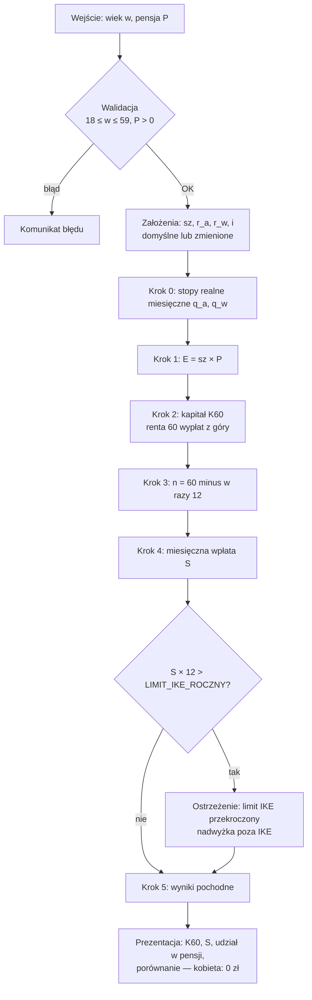

# Algorytm: ile mężczyzna musi odkładać na IKE, żeby przejść na emeryturę w wieku 60 lat

## 1. Cel i kontekst

W Polsce wiek emerytalny jest nierówny: **kobiety — 60 lat, mężczyźni — 65 lat**.
Mężczyzna, który chce zakończyć pracę w wieku 60 lat (tak jak kobieta), musi samodzielnie
sfinansować **5-letnią lukę** (60 → 65 lat), zanim zacznie otrzymywać emeryturę z ZUS.

Aplikacja obrazuje koszt tej nierówności: liczy, **ile mężczyzna musi mieć zgromadzone na
IKE w dniu 60. urodzin** oraz **ile musi w tym celu odkładać co miesiąc** od dziś.
Dla kobiety w identycznej sytuacji wynik wynosi **0 zł** — i to zestawienie jest sednem przekazu.

### Dlaczego IKE

- Wypłata z IKE po ukończeniu **60 lat** jest **zwolniona z 19% podatku od zysków kapitałowych**
  („podatku Belki"). Wypłacona kwota jest więc kwotą „na rękę" — dokładnie tym, czego
  potrzebujemy do pokrycia luki 60–65.
- Warunek zwolnienia: wpłaty w **co najmniej 5 dowolnych latach kalendarzowych** (albo ponad
  połowa wartości wpłat najpóźniej 5 lat przed wnioskiem o wypłatę) — patrz walidacje w § 8.
- Roczny **limit wpłat** na IKE (3 × prognozowane przeciętne wynagrodzenie miesięczne;
  w 2026 r.: 28 260 zł) jest realnym ograniczeniem — algorytm musi go sprawdzać.

## 2. Dane wejściowe (podaje użytkownik)

| Symbol | Nazwa | Zakres | Uwagi |
|---|---|---|---|
| `w` | Wiek | 18 – 59 | pełne lata (opcjonalnie z miesiącami — patrz § 8) |
| `P` | Pensja miesięczna **netto** | > 0 | „na rękę"; patrz decyzja D1 |

## 3. Założenia edytowalne (proponujemy domyślne wartości, użytkownik może zmienić)

| Symbol | Nazwa | Domyślnie | Opis |
|---|---|---|---|
| `sz` | Stopa zastąpienia | 50% | docelowa emerytura jako % pensji netto |
| `r_a` | Nominalna roczna stopa zwrotu — faza oszczędzania | 6,0% | portfel akcyjno-obligacyjny do 60. r.ż. |
| `r_w` | Nominalna roczna stopa zwrotu — faza wypłat (60–65) | 3,5% | bezpieczne aktywa (obligacje, lokaty) |
| `i` | Inflacja roczna | 2,5% | cel inflacyjny NBP |

## 4. Stałe systemowe (konfiguracja aplikacji, nie do edycji przez użytkownika)

| Stała | Wartość | Uwagi |
|---|---|---|
| `WIEK_EMERYTALNY_K` | 60 | wiek emerytalny kobiet |
| `WIEK_EMERYTALNY_M` | 65 | wiek emerytalny mężczyzn |
| `MIESIACE_LUKI` | 60 | `(65 − 60) × 12` |
| `LIMIT_IKE_ROCZNY` | 28 260 zł (2026) | aktualizowana co roku stała konfiguracyjna |

## 5. Kluczowe decyzje projektowe

### D1. Kwoty netto, model realny (w dzisiejszych złotówkach)

**Problem:** jak potraktować inflację, wzrost pensji i podatki, żeby wynik był zrozumiały?

Rozważane opcje:

1. **Model nominalny** — projekcja inflacji, wzrostu pensji i nominalnych kwot na 30+ lat.
   Wyniki „wyglądają groźnie" (duże liczby), ale są nieintuicyjne i wymagają dodatkowych założeń.
2. **Model realny (rekomendowany)** — wszystkie kwoty w dzisiejszych złotówkach; nominalne
   stopy zwrotu przeliczamy na realne wzorem Fishera. Zakładamy, że pensja i miesięczna wpłata
   rosną z inflacją (czyli realnie są stałe).
3. Model hybrydowy — wyniki realne + przełącznik „pokaż nominalnie". Możliwe rozszerzenie v2.

**Rekomendacja: opcja 2.** Wynik „378 zł miesięcznie w dzisiejszych pieniądzach" jest natychmiast
porównywalny z pensją użytkownika. Kompromis: kwota wpłaty w aplikacji jest realna — użytkownik
musi ją co roku indeksować o inflację (komunikujemy to w UI).

Konsekwentnie operujemy na kwotach **netto**: wypłata z IKE po 60. r.ż. jest nieopodatkowana,
więc porównanie „pensja netto ↔ wypłata z IKE" jest spójne bez modelowania podatków.

### D2. Docelowa emerytura jako stopa zastąpienia × pensja

**Problem:** skąd wziąć kwotę docelowej emerytury?

1. **Stopa zastąpienia × pensja netto (rekomendowane)** — jeden suwak, spójne z wejściem `P`,
   odpowiada temu, jak faktycznie działa system emerytalny (emerytura to ułamek pensji).
2. Kwota podana wprost przez użytkownika — mniej „opowiada historię", ale prostsze pojęciowo.
   Możliwe jako alternatywny tryb w UI (pole `E` edytowalne bezpośrednio).
3. Prognoza emerytury z ZUS (kalkulator NDC) — najdokładniejsze, ale wymaga historii składek;
   zdecydowanie poza zakresem v1.

## 6. Algorytm — krok po kroku

### Krok 0. Przeliczenie stóp na realne miesięczne

```
r_a_real = (1 + r_a) / (1 + i) − 1          # realna roczna stopa, faza oszczędzania
r_w_real = (1 + r_w) / (1 + i) − 1          # realna roczna stopa, faza wypłat

q_a = (1 + r_a_real)^(1/12) − 1             # realna miesięczna, faza oszczędzania
q_w = (1 + r_w_real)^(1/12) − 1             # realna miesięczna, faza wypłat
```

### Krok 1. Docelowa emerytura (miesięczna, netto, realnie)

```
E = sz × P
```

### Krok 2. Kapitał wymagany w dniu 60. urodzin — **wynik główny nr 1**

Wartość obecna renty: 60 comiesięcznych wypłat kwoty `E`, płatnych **z góry**
(pieniądze na życie potrzebne są na początku miesiąca), przy czym niewypłacona
reszta kapitału dalej pracuje na stopie `q_w`:

```
K60 = E × [ (1 − (1 + q_w)^(−60)) / q_w ] × (1 + q_w)        dla q_w ≠ 0
K60 = E × 60                                                  dla q_w = 0
```

### Krok 3. Długość fazy oszczędzania

```
n = (60 − w) × 12        # liczba miesięcznych wpłat do 60. urodzin
```

### Krok 4. Miesięczna wpłata na IKE — **wynik główny nr 2**

Kwota `S` (stała realnie, wpłacana na koniec każdego miesiąca), której przyszła wartość
po `n` miesiącach na stopie `q_a` równa się `K60`:

```
S = K60 × q_a / ( (1 + q_a)^n − 1 )        dla q_a ≠ 0
S = K60 / n                                 dla q_a = 0
```

### Krok 5. Wyniki pochodne (do prezentacji)

```
udzial            = S / P                    # % pensji pochłaniany przez „podatek od płci"
suma_wplat        = S × n                    # ile realnie wpłaci z własnej kieszeni
wplata_roczna     = S × 12                   # do porównania z LIMIT_IKE_ROCZNY
wynik_kobiety     = 0 zł                     # zawsze; sedno przekazu aplikacji
```

## 7. Schemat przepływu



## 8. Walidacje i przypadki brzegowe

| Warunek | Zachowanie |
|---|---|
| `w ≥ 60` | brak fazy oszczędzania — pokazujemy tylko `K60` („tyle musiałbyś mieć dziś") |
| `w > 55` | ostrzeżenie: do 60. urodzin mniej niż 5 lat kalendarzowych wpłat — ryzyko niespełnienia warunku zwolnienia podatkowego IKE |
| `S × 12 > LIMIT_IKE_ROCZNY` | ostrzeżenie + informacja, że nadwyżkę trzeba odkładać poza IKE (np. IKZE, konto maklerskie); wzmacnia przekaz o skali problemu |
| `q_a = 0` lub `q_w = 0` | wzory graniczne z kroków 2 i 4 (bez dzielenia przez zero) |
| `r < i` (realna stopa ujemna) | wzory działają dla `q < 0` — wynik poprawnie rośnie |
| założenia poza rozsądnym zakresem | ograniczenia suwaków w UI, np. stopy 0–15%, inflacja 0–10%, `sz` 20–100% |
| wiek z miesiącami | v1: pełne lata (zaokrąglenie `n` do pełnych miesięcy); ewentualnie data urodzenia w v2 |

## 9. Świadome uproszczenia (kandydaci na v2)

1. **Wpływ wcześniejszego zakończenia pracy na emeryturę z ZUS** — mężczyzna kończący pracę
   w wieku 60 lat przez 5 lat nie odprowadza składek, więc jego emerytura z ZUS od 65. r.ż.
   będzie niższa, niż gdyby pracował do 65. Pełny model musiałby doliczyć kapitał na
   dożywotnie uzupełnianie tej różnicy. v1 świadomie to pomija — obecny wynik jest więc
   **dolnym oszacowaniem** kosztu nierówności (co warto komunikować w UI).
2. **Realny wzrost pensji** — zakładamy pensję stałą realnie; historycznie płace w Polsce
   rosły szybciej niż inflacja. Rozszerzenie: parametr realnego wzrostu pensji + wpłata
   rosnąca proporcjonalnie.
3. **Sekwencja stóp zwrotu i ryzyko** — pojedyncza średnia stopa zamiast symulacji
   (np. Monte Carlo); brak stopniowej zmiany alokacji przed 60. r.ż. (glide path).
4. **Limit IKE w czasie** — limit rośnie co roku z płacami; v1 porównuje z bieżącym limitem.

## 10. Przykład liczbowy (założenia domyślne, pensja 8 000 zł netto → E = 4 000 zł)

Kapitał wymagany w dniu 60. urodzin: **K60 ≈ 234 400 zł** (w dzisiejszych złotówkach;
mniej niż naiwne 60 × 4 000 = 240 000 zł, bo kapitał w fazie wypłat dalej pracuje).

| Wiek startu | Miesięcy wpłat | Wpłata S / mies. | Rocznie | Suma wpłat | Limit IKE |
|---:|---:|---:|---:|---:|:---|
| 25 | 420 | ≈ 293 zł | ≈ 3 520 zł | ≈ 123 200 zł | OK |
| 30 | 360 | ≈ 378 zł | ≈ 4 534 zł | ≈ 136 000 zł | OK |
| 40 | 240 | ≈ 686 zł | ≈ 8 232 zł | ≈ 164 600 zł | OK |
| 50 | 120 | ≈ 1 646 zł | ≈ 19 749 zł | ≈ 197 500 zł | OK |
| 55 | 60 | ≈ 3 592 zł | ≈ 43 108 zł | ≈ 215 500 zł | **przekroczony** + ostrzeżenie o 5 latach wpłat |

Kobieta w identycznej sytuacji: **0 zł / miesiąc**.
