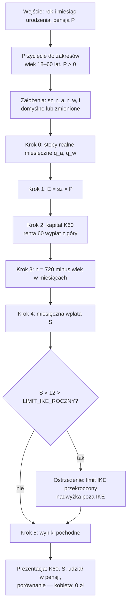

# Algorytm: ile mężczyzna musi odkładać na IKE, żeby przejść na emeryturę w wieku 60 lat

## 1. Cel i kontekst

W Polsce wiek emerytalny jest nierówny: **kobiety — 60 lat, mężczyźni — 65 lat**.
Mężczyzna, który chce zakończyć pracę w wieku 60 lat (tak jak kobieta), musi samodzielnie
sfinansować **5-letnią lukę** (60 → 65 lat), zanim zacznie otrzymywać emeryturę z ZUS.

Aplikacja obrazuje koszt tej nierówności: liczy, **ile mężczyzna musi mieć zgromadzone na
IKE w dniu 60. urodzin** oraz **ile musi w tym celu odkładać co miesiąc** od dziś.
Dla kobiety w identycznej sytuacji wynik wynosi **0 zł** — i to zestawienie jest sednem przekazu.

### Dlaczego IKE

- Wypłata z IKE po ukończeniu **60 lat** jest **zwolniona z 19% podatku od zysków kapitałowych**
  („podatku Belki"). Wypłacona kwota jest więc kwotą „na rękę" — dokładnie tym, czego
  potrzebujemy do pokrycia luki 60–65.
- Warunek zwolnienia: wpłaty w **co najmniej 5 dowolnych latach kalendarzowych** (albo ponad
  połowa wartości wpłat najpóźniej 5 lat przed wnioskiem o wypłatę) — patrz walidacje w § 8.
- Roczny **limit wpłat** na IKE (3 × prognozowane przeciętne wynagrodzenie miesięczne;
  w 2026 r.: 28 260 zł) jest realnym ograniczeniem — algorytm musi go sprawdzać.

## 2. Dane wejściowe (podaje użytkownik)

| Symbol | Nazwa                       | Zakres    | Uwagi                                                                                                                                                                 |
| ------ | --------------------------- | --------- | --------------------------------------------------------------------------------------------------------------------------------------------------------------------- |
| `w_m`  | Wiek w miesiącach           | 216 – 720 | wyliczany z **roku i miesiąca urodzenia**: `w_m = (rok_dziś − rok_ur) × 12 + (mies_dziś − mies_ur)`; pełny scenariusz dla wieku 18–59 lat, równo 60 lat = tylko `K60` |
| `P`    | Pensja miesięczna **netto** | > 0       | „na rękę"; patrz decyzja D1                                                                                                                                           |

## 3. Założenia edytowalne (proponujemy domyślne wartości, użytkownik może zmienić)

| Symbol | Nazwa                                               | Domyślnie | Opis                                    |
| ------ | --------------------------------------------------- | --------- | --------------------------------------- |
| `sz`   | Stopa zastąpienia                                   | 50%       | docelowa emerytura jako % pensji netto  |
| `r_a`  | Nominalna roczna stopa zwrotu — faza oszczędzania   | 6,0%      | portfel akcyjno-obligacyjny do 60. r.ż. |
| `r_w`  | Nominalna roczna stopa zwrotu — faza wypłat (60–65) | 3,5%      | bezpieczne aktywa (obligacje, lokaty)   |
| `i`    | Inflacja roczna                                     | 2,5%      | cel inflacyjny NBP                      |

## 4. Stałe systemowe (konfiguracja aplikacji, nie do edycji przez użytkownika)

| Stała               | Wartość          | Uwagi                                      |
| ------------------- | ---------------- | ------------------------------------------ |
| `WIEK_EMERYTALNY_K` | 60               | wiek emerytalny kobiet                     |
| `WIEK_EMERYTALNY_M` | 65               | wiek emerytalny mężczyzn                   |
| `MIESIACE_LUKI`     | 60               | `(65 − 60) × 12`                           |
| `LIMIT_IKE_ROCZNY`  | 28 260 zł (2026) | aktualizowana co roku stała konfiguracyjna |

## 5. Kluczowe decyzje projektowe

### D1. Kwoty netto, model realny (w dzisiejszych złotówkach)

Wszystkie kwoty wyrażamy **w dzisiejszych złotówkach**; nominalne stopy zwrotu przeliczamy na
realne wzorem Fishera. Zakładamy, że pensja i miesięczna wpłata rosną z inflacją (czyli realnie
są stałe). Wynik „378 zł miesięcznie w dzisiejszych pieniądzach" jest natychmiast porównywalny
z pensją użytkownika. Kompromis: kwota wpłaty w aplikacji jest realna — użytkownik musi ją co
roku indeksować o inflację (komunikujemy to w UI).

Konsekwentnie operujemy na kwotach **netto**: wypłata z IKE po 60. r.ż. jest nieopodatkowana,
więc porównanie „pensja netto ↔ wypłata z IKE" jest spójne bez modelowania podatków.

### D2. Docelowa emerytura jako stopa zastąpienia × pensja

Docelową emeryturę liczymy jako **stopa zastąpienia × pensja netto** — jeden suwak, spójny
z wejściem `P`, odpowiadający temu, jak faktycznie działa system emerytalny (emerytura to
ułamek pensji).

## 6. Algorytm — krok po kroku

### Krok 0. Przeliczenie stóp na realne miesięczne

```
r_a_real = (1 + r_a) / (1 + i) − 1          # realna roczna stopa, faza oszczędzania
r_w_real = (1 + r_w) / (1 + i) − 1          # realna roczna stopa, faza wypłat

q_a = (1 + r_a_real)^(1/12) − 1             # realna miesięczna, faza oszczędzania
q_w = (1 + r_w_real)^(1/12) − 1             # realna miesięczna, faza wypłat
```

### Krok 1. Docelowa emerytura (miesięczna, netto, realnie)

```
E = sz × P
```

### Krok 2. Kapitał wymagany w dniu 60. urodzin — **wynik główny nr 1**

Wartość obecna renty: 60 comiesięcznych wypłat kwoty `E`, płatnych **z góry**
(pieniądze na życie potrzebne są na początku miesiąca), przy czym niewypłacona
reszta kapitału dalej pracuje na stopie `q_w`:

```
K60 = E × [ (1 − (1 + q_w)^(−60)) / q_w ] × (1 + q_w)        dla q_w ≠ 0
K60 = E × 60                                                  dla q_w = 0
```

### Krok 3. Długość fazy oszczędzania

Liczona w pełnych miesiącach na podstawie roku i miesiąca urodzenia:

```
w_m = (rok_dziś − rok_ur) × 12 + (mies_dziś − mies_ur)    # wiek w miesiącach
n   = max(0, 60 × 12 − w_m)                                # miesięczne wpłaty do 60. urodzin
```

### Krok 4. Miesięczna wpłata na IKE — **wynik główny nr 2**

Kwota `S` (stała realnie, wpłacana na koniec każdego miesiąca), której przyszła wartość
po `n` miesiącach na stopie `q_a` równa się `K60`:

```
S = K60 × q_a / ( (1 + q_a)^n − 1 )        dla q_a ≠ 0
S = K60 / n                                 dla q_a = 0
```

### Krok 5. Wyniki pochodne (do prezentacji)

```
udzial            = S / P                    # % pensji pochłaniany przez „podatek od płci"
suma_wplat        = S × n                    # ile realnie wpłaci z własnej kieszeni
wplata_roczna     = S × 12                   # do porównania z LIMIT_IKE_ROCZNY
wynik_kobiety     = 0 zł                     # zawsze; sedno przekazu aplikacji
```

## 7. Schemat przepływu



## 8. Walidacje i przypadki brzegowe

| Warunek                       | Zachowanie                                                                                                                                             |
| ----------------------------- | ------------------------------------------------------------------------------------------------------------------------------------------------------ |
| `n = 0` (wiek ≥ 60 lat)       | brak fazy oszczędzania — pokazujemy tylko `K60` („tyle musiałbyś mieć dziś")                                                                           |
| `0 < n < 60`                  | ostrzeżenie: do 60. urodzin mniej niż 5 lat wpłat — ryzyko niespełnienia warunku zwolnienia podatkowego IKE                                            |
| `S × 12 > LIMIT_IKE_ROCZNY`   | ostrzeżenie + informacja, że nadwyżkę trzeba odkładać poza IKE (np. IKZE, konto maklerskie); wzmacnia przekaz o skali problemu                         |
| `q_a = 0` lub `q_w = 0`       | wzory graniczne z kroków 2 i 4 (bez dzielenia przez zero)                                                                                              |
| `r < i` (realna stopa ujemna) | wzory działają dla `q < 0` — wynik poprawnie rośnie                                                                                                    |
| wejście poza zakresem         | wartość przycinana do najbliższej granicy zakresu (bez komunikatów błędów); zakresy suwaków: stopy 0–15%, inflacja 0–10%, `sz` 20–100%; wiek 18–60 lat |

## 9. Przykład liczbowy (założenia domyślne, pensja 8 000 zł netto → E = 4 000 zł)

Można znaleźć w [IKE-PRZYKLAD.md](IKE-PRZYKLAD.md).
