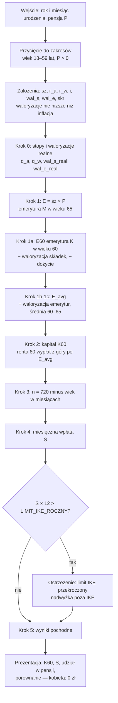

# Algorytm: ile mężczyzna musi odkładać na IKE, żeby przejść na emeryturę w wieku 60 lat

## 1. Cel i kontekst

W Polsce wiek emerytalny jest nierówny: **kobiety — 60 lat, mężczyźni — 65 lat**.
Mężczyzna, który chce zakończyć pracę w wieku 60 lat (tak jak kobieta), musi samodzielnie
sfinansować **5-letnią lukę** (60 → 65 lat), zanim zacznie otrzymywać emeryturę z ZUS.

Aplikacja obrazuje koszt tej nierówności: liczy, **ile mężczyzna musi mieć zgromadzone na
IKE w dniu 60. urodzin** oraz **ile musi w tym celu odkładać co miesiąc** od dziś.

### Dlaczego IKE

- Wypłata z IKE po ukończeniu **60 lat** jest **zwolniona z 19% podatku od zysków kapitałowych**
  („podatku Belki"). Wypłacona kwota jest więc kwotą „na rękę" — dokładnie tym, czego
  potrzebujemy do pokrycia luki 60–65.
- Warunek zwolnienia: wpłaty w **co najmniej 5 dowolnych latach kalendarzowych** (albo ponad
  połowa wartości wpłat najpóźniej 5 lat przed wnioskiem o wypłatę) — patrz walidacje w § 8.
- Roczny **limit wpłat** na IKE (3 × prognozowane przeciętne wynagrodzenie miesięczne;
  w 2026 r.: 28 260 zł) jest realnym ograniczeniem.

### Ile dokładnie musi zastąpić mężczyzna

Uczciwy punkt odniesienia to **świadczenie, jakie
w tych latach faktycznie dostaje kobieta**, przechodząc na emeryturę w wieku 60 lat — a jest
ono **niższe** od emerytury mężczyzny liczonej w wieku 65 lat, z dwóch powodów:

1. **Krótsza waloryzacja składek.** Kapitał emerytalny kobiety przestaje być waloryzowany
   (i uzupełniany) 5 lat wcześniej. Kapitał mężczyzny „dorasta" jeszcze przez lata 60–65
   o kolejne waloryzacje — dlatego jego emerytura w wieku 65 jest wyższa.
2. **Dłuższe dożycie.** Emeryturę z ZUS liczy się jako _kapitał ÷ dalsze trwanie życia
   w miesiącach_. W wieku 60 lat dalsze trwanie życia jest dłuższe niż w 65 — ten sam kapitał
   trzeba rozłożyć na więcej miesięcy, więc miesięczne świadczenie jest niższe.

Z drugiej strony emerytura kobiety **jest waloryzowana** przez te 5 lat, więc realnie rośnie.
Bierzemy więc **średnie realne świadczenie kobiety z okresu 60–65** i to ono wyznacza, ile
mężczyzna musi co miesiąc wypłacać sobie z IKE. Szczegóły — § 6, kroki 1a–1c.

## 2. Dane wejściowe (podaje użytkownik)

| Symbol | Nazwa                       | Zakres    | Uwagi                                                                                                                                                                                                                                |
| ------ | --------------------------- | --------- | ------------------------------------------------------------------------------------------------------------------------------------------------------------------------------------------------------------------------------------ |
| `w_m`  | Wiek w miesiącach           | 216 – 719 | wyliczany z **roku i miesiąca urodzenia**: `w_m = (rok_dziś − rok_ur) × 12 + (mies_dziś − mies_ur)`; zakres 18 lat – 59 lat i 11 mies. (górna granica to miesiąc przed 60. urodzinami, więc faza oszczędzania ma zawsze ≥ 1 miesiąc) |
| `P`    | Pensja miesięczna **netto** | > 0       | „na rękę"; patrz decyzja D1                                                                                                                                                                                                          |

## 3. Założenia edytowalne (proponujemy domyślne wartości, użytkownik może zmienić)

| Symbol  | Nazwa                                               | Domyślnie | Opis                                                                                        |
| ------- | --------------------------------------------------- | --------- | ------------------------------------------------------------------------------------------- |
| `sz`    | Stopa zastąpienia                                   | 50%       | docelowa emerytura mężczyzny (w wieku 65) jako % pensji netto                               |
| `r_a`   | Nominalna roczna stopa zwrotu — faza oszczędzania   | 6,0%      | portfel akcyjno-obligacyjny do 60. r.ż.                                                     |
| `r_w`   | Nominalna roczna stopa zwrotu — faza wypłat (60–65) | 3,5%      | bezpieczne aktywa (obligacje, lokaty)                                                       |
| `i`     | Inflacja roczna                                     | 2,5%      | cel inflacyjny NBP                                                                          |
| `wal_s` | **Nominalna** roczna waloryzacja składek            | 4,5%      | o ile rośnie kapitał emerytalny; brak tych 5 waloryzacji obniża emeryturę kobiety (§ 6, 1a) |
| `wal_e` | **Nominalna** roczna waloryzacja emerytur           | 4,0%      | o ile rośnie już wypłacana emerytura; podnosi średnie świadczenie kobiety 60–65 (§ 6, 1c)   |
| `skr`   | Obniżka świadczenia z tytułu dłuższego dożycia      | 13%       | o ile niższa jest emerytura w wieku 60 vs 65 z powodu dłuższego dalszego trwania życia      |

> **Uwaga.** `wal_s` i `wal_e` podaje się **nominalnie**, ale cały model liczy **realnie**
> (§ 5, D1) — obie waloryzacje przeliczamy wzorem Fishera przez inflację `i` (§ 6, krok 0).
> Domyślne 4,0% dla `wal_e` to wartość przyjęta roboczo — do potwierdzenia.

## 4. Stałe systemowe (konfiguracja aplikacji, nie do edycji przez użytkownika)

| Stała               | Wartość          | Uwagi                                      |
| ------------------- | ---------------- | ------------------------------------------ |
| `WIEK_EMERYTALNY_K` | 60               | wiek emerytalny kobiet                     |
| `WIEK_EMERYTALNY_M` | 65               | wiek emerytalny mężczyzn                   |
| `MIESIACE_LUKI`     | 60               | `(65 − 60) × 12`                           |
| `LIMIT_IKE_ROCZNY`  | 28 260 zł (2026) | aktualizowana co roku stała konfiguracyjna |

## 5. Kluczowe decyzje projektowe

### D1. Kwoty netto, model realny (w dzisiejszych złotówkach)

Wszystkie kwoty wyrażamy **w dzisiejszych złotówkach**; nominalne stopy zwrotu przeliczamy na
realne wzorem Fishera. Zakładamy, że pensja i miesięczna wpłata rosną z inflacją (czyli realnie
są stałe). Wynik „307 zł miesięcznie w dzisiejszych pieniądzach" jest natychmiast porównywalny
z pensją użytkownika. Kompromis: kwota wpłaty w aplikacji jest realna — użytkownik musi ją co
roku indeksować o inflację (komunikujemy to w UI).

Konsekwentnie operujemy na kwotach **netto**: wypłata z IKE po 60. r.ż. jest nieopodatkowana,
więc porównanie „pensja netto ↔ wypłata z IKE" jest spójne bez modelowania podatków.

### D2. Docelowa emerytura jako stopa zastąpienia × pensja

Docelową emeryturę **mężczyzny w wieku 65 lat** liczymy jako **stopa zastąpienia × pensja
netto** — jeden suwak, spójny z wejściem `P`, odpowiadający temu, jak faktycznie działa
system emerytalny (emerytura to ułamek pensji). To jest punkt wyjścia; kwota, którą mężczyzna
musi sobie wypłacać w latach 60–65, jest od niej **niższa** (patrz D3).

### D3. Świadczenie do zastąpienia = uśredniona emerytura kobiety z okresu 60–65

Mężczyzna w latach 60–65 nie odtwarza własnej emerytury z wieku 65, tylko **to, co w tym
okresie dostałaby kobieta** przechodząca na emeryturę w wieku 60 lat. Modelujemy to trzema
korektami docelowej emerytury `E` (§ 6, kroki 1a–1c):

- **− waloryzacja składek** (`wal_s`): kapitał kobiety nie rósł przez ostatnie 5 lat, więc jej
  emerytura startowa jest o tyle niższa → dzielimy przez `(1 + wal_s_real)^5`.
- **− dożycie** (`skr`): ten sam kapitał rozkładany na dłuższe dalsze trwanie życia → mnożymy
  przez `(1 − skr)`.
- **+ waloryzacja emerytur** (`wal_e`): przez 5 lat świadczenie kobiety realnie rośnie; bierzemy
  jego **średnią** z tych lat jako stałe (realnie) świadczenie, które musi zapewnić mężczyzna.

Zakładamy, że mężczyzna nie płaci w ciągu 60-65 lat składek, skoro jest na wcześniejszej emeryturze.

## 6. Algorytm — krok po kroku

### Krok 0. Przeliczenie stóp na realne miesięczne

```
r_a_real   = (1 + r_a)   / (1 + i) − 1       # realna roczna stopa, faza oszczędzania
r_w_real   = (1 + r_w)   / (1 + i) − 1       # realna roczna stopa, faza wypłat
wal_s_real = (1 + wal_s) / (1 + i) − 1       # realna roczna waloryzacja składek   (≥ 0, patrz § 8)
wal_e_real = (1 + wal_e) / (1 + i) − 1       # realna roczna waloryzacja emerytur  (≥ 0, patrz § 8)

q_a = (1 + r_a_real)^(1/12) − 1             # realna miesięczna, faza oszczędzania
q_w = (1 + r_w_real)^(1/12) − 1             # realna miesięczna, faza wypłat
```

### Krok 1. Docelowa emerytura mężczyzny (w wieku 65, miesięczna, netto, realnie)

```
E = sz × P
```

### Krok 1a. Emerytura kobiety w wieku 60 (świadczenie startowe)

Cofamy 5 lat waloryzacji składek i uwzględniamy dłuższe dożycie:

```
E60 = E / (1 + wal_s_real)^5 × (1 − skr)
```

### Krok 1b. Waloryzacja emerytury kobiety przez 5 lat (60–65)

Świadczenie kobiety w kolejnych latach `k = 0..4` (realnie):

```
E60_k = E60 × (1 + wal_e_real)^k
```

### Krok 1c. Uśrednione świadczenie do zastąpienia — podstawa dalszych obliczeń

Średnia z 5 rocznych poziomów; to ona zastępuje `E` w kroku 2:

```
E_avg = E60 × [ ((1 + wal_e_real)^5 − 1) / wal_e_real ] / 5      dla wal_e_real ≠ 0
E_avg = E60                                                       dla wal_e_real = 0
```

### Krok 2. Kapitał wymagany w dniu 60. urodzin — **wynik główny nr 1**

Wartość obecna renty: 60 comiesięcznych wypłat kwoty `E_avg`, płatnych **z góry**
(pieniądze na życie potrzebne są na początku miesiąca), przy czym niewypłacona
reszta kapitału dalej pracuje na stopie `q_w`:

```
K60 = E_avg × [ (1 − (1 + q_w)^(−60)) / q_w ] × (1 + q_w)        dla q_w ≠ 0
K60 = E_avg × 60                                                  dla q_w = 0
```

### Krok 3. Długość fazy oszczędzania

Liczona w pełnych miesiącach na podstawie roku i miesiąca urodzenia:

```
w_m = (rok_dziś − rok_ur) × 12 + (mies_dziś − mies_ur)    # wiek w miesiącach (≤ 719)
n   = 60 × 12 − w_m                                        # miesięczne wpłaty do 60. urodzin (≥ 1)
```

### Krok 4. Miesięczna wpłata na IKE — **wynik główny nr 2**

Kwota `S` (stała realnie, wpłacana na koniec każdego miesiąca), której przyszła wartość
po `n` miesiącach na stopie `q_a` równa się `K60`:

```
S = K60 × q_a / ( (1 + q_a)^n − 1 )        dla q_a ≠ 0
S = K60 / n                                 dla q_a = 0
```

### Krok 5. Wyniki pochodne (do prezentacji)

```
udzial            = S / P                    # % pensji pochłaniany przez „podatek od płci"
suma_wplat        = S × n                    # ile realnie wpłaci z własnej kieszeni
wplata_roczna     = S × 12                   # do porównania z LIMIT_IKE_ROCZNY
wynik_kobiety     = 0 zł                     # zawsze; sedno przekazu aplikacji
```

## 7. Schemat przepływu



## 8. Walidacje i przypadki brzegowe

| Warunek                         | Zachowanie                                                                                                                                                                                                                                            |
| ------------------------------- | ----------------------------------------------------------------------------------------------------------------------------------------------------------------------------------------------------------------------------------------------------- |
| `n < 60`                        | ostrzeżenie: do 60. urodzin mniej niż 5 lat wpłat — ryzyko niespełnienia warunku zwolnienia podatkowego IKE                                                                                                                                           |
| `S × 12 > LIMIT_IKE_ROCZNY`     | ostrzeżenie + informacja, że nadwyżkę trzeba odkładać poza IKE (np. IKZE, konto maklerskie); wzmacnia przekaz o skali problemu                                                                                                                        |
| `q_a = 0` lub `q_w = 0`         | wzory graniczne z kroków 2 i 4 (bez dzielenia przez zero)                                                                                                                                                                                             |
| `wal_e_real = 0`                | wzór graniczny z kroku 1c (`E_avg = E60`, bez dzielenia przez zero)                                                                                                                                                                                   |
| `r < i` (realna stopa ujemna)   | wzory działają dla `q < 0` — wynik poprawnie rośnie                                                                                                                                                                                                   |
| **`wal_s < i` lub `wal_e < i`** | **waloryzacja nie może być niższa od inflacji** (gwarancja ustawowa) — nominalną waloryzację podnosimy do `i`, więc `wal_s_real ≥ 0` i `wal_e_real ≥ 0`. To ograniczenie zależy dynamicznie od `i`: efektywne minimum suwaka śledzi bieżącą inflację. |
| wejście poza zakresem           | wartość przycinana do najbliższej granicy zakresu (bez komunikatów błędów); zakresy suwaków: stopy 0–15%, inflacja 0–10%, `sz` 20–100%; `wal_s`, `wal_e` `i`–15%; `skr` 0–30%; wiek 18 lat – 59 lat i 11 mies.                                        |

## 9. Przykład liczbowy (założenia domyślne, pensja 8 000 zł netto)

Docelowa emerytura mężczyzny `E = 4 000 zł`, ale świadczenie do zastąpienia w latach 60–65
(uśredniona emerytura kobiety) `E_avg ≈ 3 253 zł`, stąd kapitał `K60 ≈ 190 600 zł`.
Pełne przeliczenie krok po kroku (wraz z tabelą wieków) w [IKE-PRZYKLAD.md](IKE-PRZYKLAD.md).
