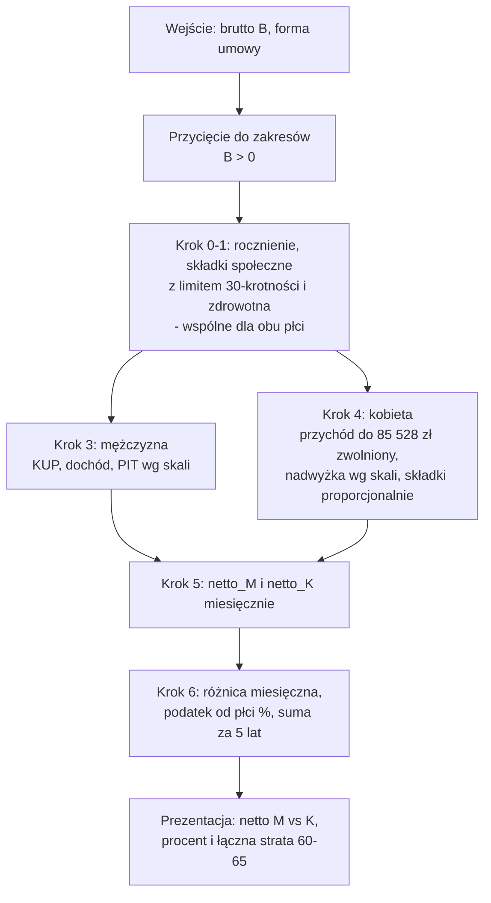

# Algorytm: ile mężczyzna zapłaci PIT w latach 60–65, którego nie zapłaci kobieta (PIT-0 dla seniora)

## 1. Cel i kontekst

W Polsce wiek emerytalny jest nierówny: **kobiety — 60 lat, mężczyźni — 65 lat**.
Nierówność nie kończy się na samej emeryturze: kobieta, która po 60. urodzinach **dalej
pracuje i nie pobiera emerytury**, korzysta z **ulgi dla pracujących seniorów („PIT-0 dla
seniora", art. 21 ust. 1 pkt 154 ustawy o PIT)** — jej przychody do **85 528 zł rocznie** są
zwolnione z podatku dochodowego. Mężczyzna w tym samym wieku, na tym samym stanowisku,
z tą samą pensją brutto — **płaci PIT normalnie**, bo prawo do ulgi nabywa dopiero w wieku 65 lat.

Aplikacja obrazuje koszt tej nierówności: liczy, **o ile niższą wypłatę netto dostaje
mężczyzna w wieku 60–65 lat** niż kobieta z identyczną pensją brutto, oraz **ile łącznie
„nadpłaci" podatku przez te 5 lat**.

### Jak działa ulga dla pracujących seniorów

- Przysługuje osobie, która **osiągnęła wiek emerytalny** (K: 60, M: 65), **nie pobiera**
  emerytury ani renty rodzinnej i **podlega ubezpieczeniom społecznym** z tytułu przychodów
  objętych ulgą.
- Obejmuje przychody z **umowy o pracę** i **umowy zlecenia** (art. 13 pkt 8) — do łącznego
  limitu **85 528 zł przychodu (brutto) rocznie**.
- Nadwyżka ponad limit jest opodatkowana na zasadach ogólnych, a senior zachowuje pełną
  **kwotę wolną 30 000 zł** — efektywnie kobieta zaczyna płacić PIT dopiero powyżej
  ok. **115 528 zł** przychodu rocznie.
- Ulga zwalnia **tylko z PIT** — składki ZUS i składka zdrowotna są płacone normalnie,
  dlatego jedyna różnica między płciami to podatek dochodowy.

## 2. Dane wejściowe (podaje użytkownik)

| Symbol  | Nazwa                        | Zakres          | Uwagi                                                          |
| ------- | ---------------------------- | --------------- | -------------------------------------------------------------- |
| `B`     | Pensja miesięczna **brutto** | > 0             | ta sama dla mężczyzny i kobiety — porównujemy identyczną pracę |
| `forma` | Forma umowy                  | `uop` \| `zlec` | umowa o pracę / umowa zlecenie                                 |

## 3. Założenia (najczęstszy przypadek podatnika — decyzja D3)

Obie osoby rozliczają się identycznie; różni je wyłącznie prawo do ulgi:

- rozliczenie **indywidualne** (bez małżonka), **brak innych ulg i odliczeń** (dzieci,
  darowizny, IKZE, ulga na internet itd.),
- umowa o pracę: **standardowe koszty uzyskania przychodu** 250 zł/mies. (nie podwyższone
  300 zł dla dojeżdżających), **brak PPK**, jeden etat,
- umowa zlecenie: **jedyny tytuł do ubezpieczeń** (składki emerytalna i rentowa obowiązkowe),
  **bez dobrowolnej składki chorobowej** — większość zleceniobiorców jej nie opłaca,
  koszty 20%, bez kosztów autorskich 50%,
- kobieta **nie pobiera emerytury** w latach 60–65 (warunek ulgi) — pracuje dokładnie tak
  samo jak mężczyzna,
- przychody tylko z jednej umowy; **uwzględniamy limit 30-krotności podstawy składek** — powyżej
  rocznego limitu składki emerytalna i rentowa nie są już pobierane (chorobowa i zdrowotna bez
  limitu; § 6 krok 1).

## 4. Stałe systemowe (konfiguracja aplikacji, aktualizowana co roku; wartości 2026)

| Stała              | Wartość    | Uwagi                                                                           |
| ------------------ | ---------- | ------------------------------------------------------------------------------- |
| `SKL_EMERYTALNA`   | 9,76%      | część pracownika/zleceniobiorcy                                                 |
| `SKL_RENTOWA`      | 1,5%       | część pracownika/zleceniobiorcy                                                 |
| `SKL_CHOROBOWA`    | 2,45%      | tylko UoP (obowiązkowa); na zleceniu nieopłacana (§ 3)                          |
| `SKL_ZDROWOTNA`    | 9%         | liczona od przychodu po składkach społecznych; nieodliczalna                    |
| `KUP_UOP_ROCZNE`   | 3 000 zł   | 12 × 250 zł, standardowe koszty pracownicze                                     |
| `KUP_ZLEC_STOPA`   | 20%        | od przychodu pomniejszonego o składki społeczne                                 |
| `LIMIT_ULGI`       | 85 528 zł  | roczny limit przychodu zwolnionego (PIT-0 dla seniora)                          |
| `PROG_SKALI`       | 120 000 zł | granica między stawkami 12% i 32%                                               |
| `STAWKA_1`         | 12%        | pierwszy próg skali                                                             |
| `STAWKA_2`         | 32%        | drugi próg skali                                                                |
| `KWOTA_ZMNIEJSZ`   | 3 600 zł   | 12% × 30 000 zł kwoty wolnej                                                    |
| `LIMIT_30KROTNOSC` | 282 600 zł | roczny limit podstawy składek emerytalnej i rentowej – powyżej nie są pobierane |
| `MIESIACE_LUKI`    | 60         | `(65 − 60) × 12`                                                                |

## 5. Kluczowe decyzje projektowe

### D1. Ujęcie roczne, wynik miesięczny jako 1/12

Podatek liczymy **w skali roku** (tak jak w zeznaniu rocznym — to ono wyznacza ostateczne
obciążenie) i dzielimy przez 12. Dzięki temu nie modelujemy miesięcznych zaliczek ani
momentu „przekroczenia" progu skali czy limitu ulgi w trakcie roku — miesięczne netto jest
średnią roczną, a nie kwotą z konkretnego miesiąca na pasku wypłaty.

### D2. Model statyczny w dzisiejszych parametrach

Pensja brutto, progi, limity i stawki są **stałe przez całe 5 lat** — liczymy w dzisiejszych
złotówkach i dzisiejszym stanie prawnym. Łączna różnica za lata 60–65 to po prostu
`60 × różnica miesięczna`. Kompromis: rzeczywista kwota będzie inna, jeśli ustawodawca
zmieni progi/limity albo pensja wzrośnie — ale kierunek i skala nierówności pozostają.

### D3. Najczęstszy przypadek podatnika

Modelujemy statystycznie typową sytuację (§ 3), bo celem jest pokazanie **nierówności**, a nie
odwzorowanie każdej konfiguracji ulg. Wszystkie uproszczenia działają **symetrycznie** dla obu
płci, więc nie zniekształcają różnicy.

### D4. Definicja „podatku od płci"

Procentowy „podatek od płci" odnosimy do **netto kobiety** — punktu odniesienia „ile dostałby
mężczyzna, gdyby prawo traktowało go równo":

```
podatek_od_plci = (netto_K − netto_M) / netto_K
```

Czyli: „mężczyzna dostaje o X% niższą wypłatę netto niż kobieta przy identycznym brutto".

### D5. Składki od przychodu zwolnionego nie są odliczalne

Zgodnie z art. 26 ust. 1 pkt 2 ustawy o PIT składki społeczne, których podstawą jest przychód
zwolniony, **nie podlegają odliczeniu** od dochodu. Gdy kobieta przekracza limit ulgi, składki
dzielimy **proporcjonalnie** między część zwolnioną i opodatkowaną przychodu — odliczalna jest
tylko część przypadająca na przychód opodatkowany (krok 4).

## 6. Algorytm — krok po kroku

### Krok 0. Rocznienie

```
B_rok = 12 × B
```

### Krok 1. Składki społeczne i zdrowotna (identyczne dla obu płci)

Składki emerytalna i rentowa liczone są od podstawy ograniczonej rocznym limitem 30-krotności;
chorobowa (tylko UoP) i zdrowotna są bez limitu. Dla `B_rok ≤ LIMIT_30KROTNOSC` sprowadza się to
do dotychczasowej stopy łącznej (UoP 13,71%, zlecenie 11,26%):

```
podst_er     = min(B_rok, LIMIT_30KROTNOSC)
skladki_er   = (SKL_EMERYTALNA + SKL_RENTOWA) × podst_er
skladki_chor = SKL_CHOROBOWA × B_rok                    # tylko UoP; zlecenie: 0
skladki_spol = skladki_er + skladki_chor
zdrowotna    = SKL_ZDROWOTNA × (B_rok − skladki_spol)
```

### Krok 2. Funkcja pomocnicza: podatek wg skali

Podstawę i podatek zaokrąglamy do pełnych złotych (jak w zeznaniu rocznym):

```
PIT(d):
    p = round(d)                                            # podstawa w pełnych złotych
    t = STAWKA_1 × min(p, PROG_SKALI)
      + STAWKA_2 × max(0, p − PROG_SKALI)
      − KWOTA_ZMNIEJSZ
    return round(max(t, 0))
```

### Krok 3. Podatek mężczyzny (bez ulgi)

```
KUP_M   = KUP_UOP_ROCZNE                               # UoP
KUP_M   = KUP_ZLEC_STOPA × (B_rok − skladki_spol)      # zlecenie

dochod_M = B_rok − skladki_spol − KUP_M
PIT_M    = PIT(dochod_M)
```

### Krok 4. Podatek kobiety (z ulgą PIT-0 dla seniora)

Przychód dzielimy na część zwolnioną (do limitu) i opodatkowaną; składki społeczne
przypisujemy proporcjonalnie (D5), a koszty naliczamy tylko od części opodatkowanej:

```
przych_zwol = min(B_rok, LIMIT_ULGI)
przych_opod = B_rok − przych_zwol
u           = przych_opod / B_rok                       # udział części opodatkowanej

skladki_odl = skladki_spol × u

KUP_K = min(KUP_UOP_ROCZNE, przych_opod)                # UoP: pełne KUP, max do przychodu
KUP_K = KUP_ZLEC_STOPA × (przych_opod − skladki_odl)    # zlecenie: 20% od części opodatkowanej

dochod_K = przych_opod − skladki_odl − KUP_K
PIT_K    = PIT(dochod_K)                                # dla B_rok ≤ LIMIT_ULGI: PIT_K = 0
```

### Krok 5. Wypłaty netto (miesięczne) — **wyniki główne nr 1 i 2**

```
netto_M = (B_rok − skladki_spol − zdrowotna − PIT_M) / 12
netto_K = (B_rok − skladki_spol − zdrowotna − PIT_K) / 12
```

### Krok 6. Miara nierówności — **wyniki główne nr 3 i 4**

```
roznica_mies    = netto_K − netto_M                     # = (PIT_M − PIT_K) / 12
podatek_od_plci = roznica_mies / netto_K                # D4; procent
suma_5_lat      = roznica_mies × MIESIACE_LUKI          # = (PIT_M − PIT_K) × 5
```

## 7. Schemat przepływu



## 8. Walidacje i przypadki brzegowe

| Warunek                           | Zachowanie                                                                                                                                       |
| --------------------------------- | ------------------------------------------------------------------------------------------------------------------------------------------------ |
| `B_rok ≤ LIMIT_ULGI`              | cały przychód kobiety zwolniony: `PIT_K = 0` — wynika wprost z wzorów (krok 4), bez osobnej gałęzi                                               |
| `PIT_M = 0` (bardzo niska pensja) | różnica = 0 — komunikat: przy tej pensji kwota wolna zeruje podatek obu płci, ulga nic nie zmienia                                               |
| `B × 12 > LIMIT_30KROTNOSC`       | powyżej limitu składki emerytalna i rentowa nie są pobierane – uwzględniane wprost w kroku 1 (chorobowa i zdrowotna bez limitu), bez ostrzeżenia |
| `dochod_K < 0` (teoretycznie)     | `PIT(d)` obcina do zera przez `max(t, 0)`; dodatkowo `KUP_K ≤ przych_opod` gwarantuje `dochod_K ≥ 0` przy UoP                                    |
| zaokrąglenia                      | podstawa opodatkowania i roczny podatek do pełnych złotych (< 50 gr w dół, ≥ 50 gr w górę); netto prezentowane z groszami                        |
| wejście poza zakresem             | wartość przycinana do najbliższej granicy zakresu (bez komunikatów błędów); zakres suwaka `B`: 1 000 – 60 000 zł                                 |

## 9. Przykład liczbowy (umowa o pracę, brutto 8 000 zł/mies.)

Mężczyzna płaci `PIT_M = 5 981 zł` rocznie, kobieta dzięki uldze `PIT_K = 0` (nadwyżka ponad
limit mieści się w kwocie wolnej), stąd `netto_M ≈ 5 783,50 zł`, `netto_K ≈ 6 281,91 zł`,
„podatek od płci" ≈ 7,9% i łączna strata za 5 lat `29 905 zł`. Pełne przeliczenie krok po kroku
(wraz z tabelami dla innych pensji i umowy zlecenia) w [PIT-0-PRZYKLAD.md](PIT-0-PRZYKLAD.md).
